# W — Agent Matrix [ Antigravity 2.0 ]

> **System Purpose:** A high-focus, tactical Command Center featuring a viewport-locked habits/todos dashboard anchored by the **SleepTube** "Waking Fuel" gauge. 
> **Core Loop:** Daily habit tracking with active streak tracking, automated lockouts, and persistent widgets.
> **Tech Stack:** Tauri v2 (Rust) + React (Vite / TS) + Firebase Firestore + Pure Vanilla CSS.

---

## The Agent Matrix

```mermaid
graph TD
    User([User Task]) --> Router{Routing Matrix}
    Router --> Core[Core_Architect]
    Router --> Front[Frontend_Specialist]
    Router --> Data[Data_State_Engineer]
    Router --> Sec[Security_Quality_Auditor]

    style Router fill:#111214,stroke:#5B8DEF,stroke-width:2px
    style Core fill:#111214,stroke:#E8736C,stroke-width:1px
    style Front fill:#111214,stroke:#5B8DEF,stroke-width:1px
    style Data fill:#111214,stroke:#4ade80,stroke-width:1px
    style Sec fill:#111214,stroke:#ffffff,stroke-width:1px
```

### 1. [ Core_Architect ]
* **Role**: Manages the native OS layer, window lifecycle, background processes, system tray integration, and Tauri Rust-to-JS bridge boundaries.
* **Domain/Tech Stack**: Tauri v2, Rust (Win32 APIs, workerw, window-shadows), Cargo, NSIS.
* **Strict Operational Constraints**:
  - **No Main Thread Blocking**: Move any window polling, file I/O, or OS tracking to async tasks or secondary background threads (e.g., WorkerW or foreground window hooks).
  - **IPC Integrity**: All Rust commands must return strongly-typed serializable payloads matching TypeScript interfaces.
  - **Z-Order Defense**: Pinned windows (Widget App) must maintain strict OS bottom-pinning and focus-redirect guards.
  - **System Tray Controls**: The Windows System Tray icon must be the sole entry point for a clean application exit (`app.exit(0)`).

### 2. [ Frontend_Specialist ]
* **Role**: Governs the user interface, typography hierarchy, aesthetic consistency, responsive layouts, motion profiles, and interaction design.
* **Domain/Tech Stack**: React 18+, Vite, TypeScript, Pure CSS (Vanilla CSS only; zero Tailwind/libs), Lucide React (outline).
* **Strict Operational Constraints**:
  - **Viewport Isolation**: Strictly constrain the dashboard to `100vh`. Disable page-level scroll (`overflow: hidden`). Enable internal container scroll (`overflow-y: auto`) *only* when content overflows.
  - **Zero Utility Bloat**: Do not introduce utility classes or CSS-in-JS. All styling must consume variables defined in `src/index.css`.
  - **Endfield Aesthetic**: Every page and section header must strictly adhere to the bracketed uppercase title format: `[ NAME ]`.
  - **No React Namespace Imports**: Never use `import React from 'react'`. Always import hooks and types directly (`import { useState } from 'react'`).

### 3. [ Data_State_Engineer ]
* **Role**: Orchestrates database connections, localized state providers, daily cycle calculations, local caching, and real-time cross-webview synchronization.
* **Domain/Tech Stack**: Firestore SDK, React Context/Providers, Web Storage API (LocalStorage), Tauri IPC Events, IndexedDB (idb-keyval), Google Drive REST API.
* **Strict Operational Constraints**:
  - **Race Condition Prevention**: Synchronously commit critical setting modifications (e.g., daily reset shifts) to `localStorage` *before* updating React state variables.
  - **Timezone-Aware Reset Logic**: Daily cycle queries must compute shifted dates dynamically when local clocks fall behind user-customized daily reset hours (e.g., 04:00 AM shifts `today` to `YYYY-MM-DD - 1`).
  - **Webview Syncing**: Listen and reactively sync state between isolated Tauri windows using lightweight IPC events (`widget-habit-updated`). Maintain seamless data re-fetching.
  - **Firebase Optimization**: Bind/unbind listeners dynamically; never allow active Firestore subscriptions to drift or leak memory on unmount.
  - **Local-First Caching & Google Drive Sync**: All plain-text Daily Notes must save instantly and synchronously to local IndexedDB (under keys `note_record_YYYY-MM-DD`). The background sync worker manages seamless mirroring to the user's personal Google Drive folder (`W_Logbook/[Year]/[Date].md`) using a 5-minute heartbeat and instant reconnection triggers.
  - **Event-Driven UI Reactivity**: Broadcast note saving/sync states globally using CustomEvents (`w:note-saved` and `w:note-synced`). Active UI elements (Dashboard, Logbook feed, slide-out Archive) must subscribe to these events to dynamically update their visual panels and sync badges instantly without hard-reloads.
  - **Google Drive Integration Lockout**: The `isDriveLinked` reactive status in `AuthContext` governs feature lockdowns. If `isDriveLinked` is false, access to the `Daily Note` input editor and the historical `Logbook Archive` timeline page is strictly blocked and replaced by a pulsing, high-fidelity `<GDriveLockout>` interceptor card/page, urging the user to securely activate cloud sync inside settings to prevent local data loss.
  - **Event-Driven OAuth Reactivity**: Synchronize the `isDriveLinked` state between the non-react background Google Drive token caching service (`googleDriveService.ts`) and the React hook (`useAuth.ts`) via standard window events `w:gdrive-linked` and `w:gdrive-unlinked`. The hook reactively captures these events to toggle `isDriveLinked` in sub-milliseconds and updates the persistent `driveLinked` state in `localStorage` synchronously.
  - **Secure Desktop OAuth Flow (PKCE)**: Desktop integrations must strictly avoid embedding client secrets. The Tauri client implements Proof Key for Code Exchange (PKCE) flow compliant with RFC 7636. Prior to system browser redirection, a cryptographically secure high-entropy random verifier string (`[A-Za-z0-9\-._~]`) is generated alongside its SHA-256 hashed and Base64url-encoded code challenge (`code_challenge_method=S256`). This code challenge is sent to Google, and the unhashed code verifier is securely presented during the POST token exchange request to fetch the access/refresh credentials without exposing any secrets.

### 4. [ Security_Quality_Auditor ]
* **Role**: Guards system safety boundaries, validates input integrity, manages Firestore security rules, and enforces compilation/typing correctness.
* **Domain/Tech Stack**: Firestore Security Rules (`firestore.rules`), Tauri Security Capabilities, TypeScript Compiler, Build Pipelines.
* **Strict Operational Constraints**:
  - **Self-Lockout Safeguard**: System monitoring hooks must validate application process IDs and window titles to ensure the Command Center never blocks itself.
  - **Zero Default Trapping**: Validations on numeric and custom metrics must block submissions of uncalibrated or out-of-bounds metrics (e.g., habit targets must block values < 2 for metrics, and < 1 for limiters).
  - **Input Sanitization**: Reject any raw or unvalidated external parameters in IPC bridges.
  - **TypeScript Zero-Error Standard**: All changes must successfully pass typing checks (`tsc`) with zero errors in `tsconfig.json`.

### 5. [ Lockout Penance & Difficulty System ]
* **Zero-Bypass Form State**: Users cannot bypass the lockout overlay by clicking cancel on compensation forms. The form wizards (`HabitForm`, `TodoForm`) are securely embedded **inline** within the `PunishmentModal` overlay. Cancelling a form simply routes the user back to the primary penance choice menu without unlocking the viewport.
* **Delayed Strike Resolution**: Strikes are strictly reset only *after* successful database writing of compensatory habits/todos, at which point the app reactively unlocks.
* **Interactive Difficulty Escalation**: Selecting difficulty increase dynamically prompts the user to select an active metric or limiter habit to calibrate:
  * **Metric Habits**: Raise target value by $+33\%$ (min $+1$).
  * **Limiter Habits**: Restrict/decrease target limit by $-33\%$ (min $-1$, clamped to a minimum target value of `1`).

---

## Core Architectural Rules (Non-Negotiable)

1. **Feature Isolation**: Code is strictly grouped by feature under `src/features/`. Never import from another feature's internal modules; consume only through public entrypoints (`index.ts`).
2. **Design System Adherence**: Consumption of typography classes (`.t-display`, `.t-body`, `.t-label`, `.t-meta`, `.t-data`) and CSS variables (`--bg-base`, `--bg-surface`, `--accent`, `--strike-red`) is mandatory.
3. **Verification Standard**: Every implementation must be proven functional via targeted test checkpoints (terminal audits, console logs, or UI validation) to prevent "catfish code".

---

## Modular File Map (Layout Structure)
* `src/App.tsx` & `src/app/routes.tsx` — Application Router & shell navigation.
* `src/app/Layout.tsx` — Phase-state loader UI (Loading → Processing → Ready).
* `src/features/` — Feature modules: `dashboard`, `habits`, `todos`, `logs`, `analytics`, `strikes`, `sticky-notes`, `lockdown`, `widget`, `freeze`, `auth`, `settings`, `updater`, `wallpaper`.
* `src/shared/` — Reusable components, utility providers, and generic hooks.
